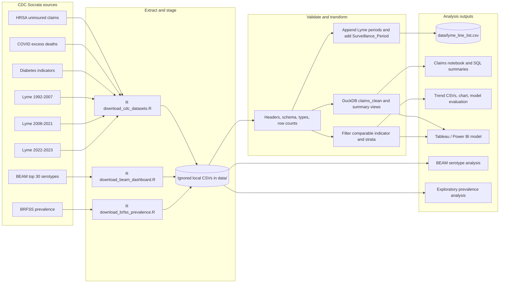
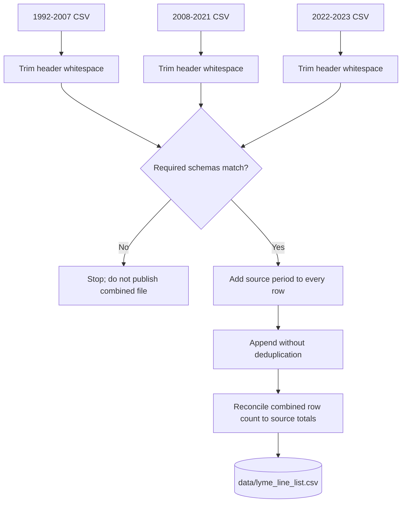
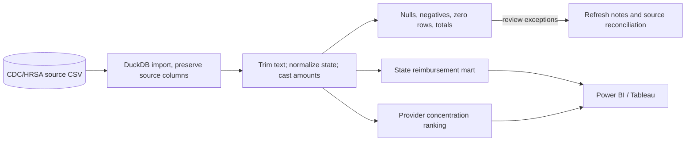
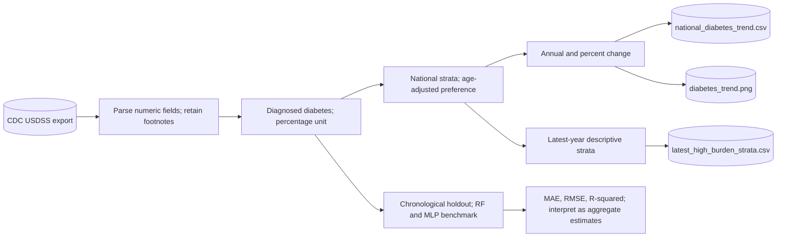

# ETL Pipelines and Data Lineage

This guide follows each dataset from its CDC source to the project outputs. Run the commands from the repository root. Raw exports stay in the Git-ignored `data/` folder; the Socrata IDs and download scripts make each refresh reproducible.

## Portfolio data flow

## Source and artifact registry

| Project input | CDC dataset | Dataset ID | Local output |
| --- | --- | --- | --- |
| Uninsured-care reimbursement | [Claims Reimbursement to Health Care Providers and Facilities](https://data.cdc.gov/d/rksx-33p3), published by HRSA | `rksx-33p3` | `data/claims_reimbursement.csv` |
| COVID-19 excess deaths | [Excess Deaths Associated with COVID-19](https://data.cdc.gov/d/xkkf-xrst) | `xkkf-xrst` | `data/covid_excess_deaths.csv` |
| National diabetes indicators | [USDSS National Burden/Magnitude Diabetes Indicators](https://data.cdc.gov/d/c9xs-vhst) | `c9xs-vhst` | `data/diabetes_indicators.csv` |
| Lyme line list, 1992-2007 | [CDC public-use line list](https://data.cdc.gov/d/e2a5-s9pr) | `e2a5-s9pr` | `data/lyme_1992_2007.csv` |
| Lyme line list, 2008-2021 | [CDC public-use line list](https://data.cdc.gov/d/abzs-b3gw) | `abzs-b3gw` | `data/lyme_2008_2021.csv` |
| Lyme line list, 2022-2023 | [CDC public-use line list](https://data.cdc.gov/d/9mtj-y2ba) | `9mtj-y2ba` | `data/lyme_2022_2023.csv` |
| BEAM dashboard | [Top 30 Most Common Serotypes](https://data.cdc.gov/d/ch83-ush6) | `ch83-ush6` | `data/beam_top_30_serotypes.csv` |
| BRFSS prevalence | [BRFSS Prevalence Data, 2011 to present](https://data.cdc.gov/d/dttw-5yxu) | `dttw-5yxu` | `data/brfss_prevalence.csv` |

## Refresh procedure

1. Install R, then run `Rscript R/download_cdc_datasets.R` to refresh claims, excess-death, diabetes, and Lyme data. The script rebuilds the combined Lyme file.
2. Run `Rscript R/download_beam_dashboard.R` to refresh BEAM data.
3. Run `Rscript R/download_brfss_prevalence.R` only when BRFSS is needed; its multi-million-row export can take time and disk space.
4. Before analysis, check source headers and row counts. The Lyme schemas are checked before appending, and records are not deduplicated because the public-use files have no shared record key.
5. Run `Rscript R/diabetes_trend_analysis.R` to regenerate the diabetes chart and summary CSVs under `outputs/`.
6. After refreshing the claims CSV, rerun the SQL notebook to rebuild its DuckDB table and views. Check grain and field definitions before refreshing dashboard extracts.

The Socrata endpoint returns the latest published snapshot and overwrites the local copy. Historical snapshots and refresh logs are not retained, so record the retrieval date and source IDs when an analysis needs to be auditable.

## Lyme disease append pipeline

The Lyme exports represent three surveillance eras. The ETL trims the historical trailing space in `Facial_palsy `, checks that the column sets match, aligns their order, appends rows, and adds `Surveillance_Period` to preserve each row's origin.

The combined file is useful for shared cleaning and exploration, but it does not make measurements comparable across all years. CDC changed Lyme case definitions in 2008 and 2022, so analyses should be stratified or annotated by `Surveillance_Period` rather than shown as an unqualified continuous trend. Keep suppressed, missing, and unknown values distinct.

## Claims reimbursement ETL

1. **Extract and load:** Download dataset `rksx-33p3` into `data/claims_reimbursement.csv`. Each source row represents a provider/city/state record; DuckDB preserves the original column names.
2. **Clean:** Trim provider and city text, uppercase state abbreviations, and cast payment columns to `DECIMAL(14,2)`. The summary view coalesces null or invalid payments to zero only after missingness is measured; an imputed zero is not an observed payment.
3. **Transform:** Build `claims_clean`, aggregate category amounts by state, calculate vaccine share, and rank provider/state totals with window functions.
4. **Validate:** Reconcile imported row counts and payment totals. Check blank provider, state, and city values, along with negative and all-zero payments.
5. **Publish:** Use provider- and state-level summaries in the dashboard, labeled as reimbursement measures rather than patient counts or utilization rates.

## Diabetes indicators ETL and modeling

1. **Extract and load:** Download dataset `c9xs-vhst` to `data/diabetes_indicators.csv`, preserving the published strata and footnotes.
2. **Type conversion:** Parse year, estimate, standard error, and confidence limits as numeric. Suppression markers and footnote text remain available in the source table but are missing from numeric calculations.
3. **Filter:** Keep diagnosed-diabetes percentage rows for national all-age strata. Prefer age-adjusted estimates; use crude values only when an age-adjusted value is unavailable for that year.
4. **Transform:** Order by year, calculate absolute and percent change, and select latest-year strata for a descriptive high-burden table.
5. **Validate:** Require national results and review year coverage, duplicate year/age combinations, confidence limits, and footnotes. In the Python model, later years form the holdout; report MAE/RMSE/$R^2$ separately from the descriptive trend.
6. **Publish:** Write `outputs/national_diabetes_trend.csv`, `outputs/latest_high_burden_strata.csv`, and `outputs/diabetes_trend.png`.

## COVID-19 excess-deaths ETL

1. **Extract and load:** Download dataset `xkkf-xrst` to `data/covid_excess_deaths.csv`, retaining the weekly state, outcome, and estimate fields.
2. **Type:** Parse week-ending date, year, observed count, expected threshold, excess estimates, and percentages. Preserve CDC's `Suppress`, `Exceeds Threshold`, `Type`, and `Note` fields.
3. **Transform:** Define summaries by outcome, measure type, state, and week. Do not sum cumulative or total fields unless the source definition supports it.
4. **Validate:** Review suppression, duplicate state/week/outcome combinations, date coverage, and unexpected negative or missing estimates. Compare sample rows with the source catalog.
5. **Publish:** Include the CDC source ID and retrieval date. Describe provisional excess-death values as estimates, not exact counts or causal effects.

## BEAM serotype ETL

1. **Extract and load:** Run `Rscript R/download_beam_dashboard.R` to save dataset `ch83-ush6` as `data/beam_top_30_serotypes.csv`.
2. **Type:** Parse year, quarter, month, isolate count, past-two-years average, and percent change while preserving pathogen and serotype/species/subgroup labels.
3. **Transform:** Filter and group without dropping the time period or pathogen. This is a top-30 dashboard export, not a complete isolate line list.
4. **Validate:** Check time ranges, non-negative isolate counts, and ranking context. Review zero or blank averages before calculating percent changes.
5. **Publish:** Label results as BEAM top-serotype data. The source has no HHS-region field and cannot replace a regional-isolate dataset.

## BRFSS prevalence ETL

1. **Extract and load:** Run `Rscript R/download_brfss_prevalence.R` to save the multi-million-row aggregate export as `data/brfss_prevalence.csv`.
2. **Type:** Parse year, estimate, confidence limits, and sample size while preserving question, response, topic, breakout, footnote, and data-value-type fields.
3. **Transform:** Compare like-for-like estimates by year, location, question/indicator, response, breakout, and prevalence type. Do not average strata without defensible weights.
4. **Validate:** Review confidence limits, sample size, footnotes, suppressed estimates, and survey-definition changes before publishing.
5. **Publish:** Describe results as aggregate prevalence. This export is not respondent-level data and cannot support person-level risk models or a clinical metabolic-syndrome diagnosis.

These datasets stay separate from the claims and diabetes fact tables because their grains and measures differ.

Keep source-specific cleaning and limitations visible. Join project outputs only through dimensions with compatible definitions; provider rows should not be joined directly to diabetes strata or Lyme line-list records.

## Reconciliation checklist

- Record the source dataset ID and retrieval date.
- Confirm that each downloaded file is non-empty and has its expected header.
- Track row counts before and after filters or appends.
- For Lyme, reconcile combined rows to the three period files and verify all period labels.
- For claims, reconcile payment categories and review null, zero, and negative values.
- For diabetes, report the selected indicator, unit, years, strata, and age-adjustment choice.
- For excess deaths, retain suppression/provisional markers and document outcome and estimate type.
- For BEAM and BRFSS, preserve the dimensions and footnotes needed to interpret ranking, period, question, and suppression.
- Keep generated outputs separate from source files; never commit CDC exports under `data/`.
