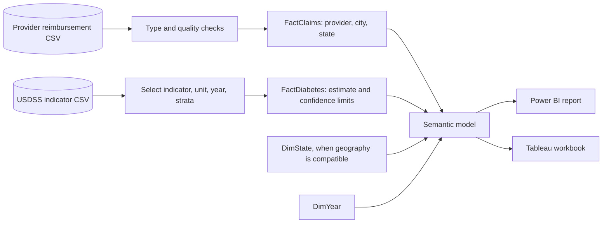

# Healthcare access and burden dashboard specification

## Dashboard concept

**Title:** Uninsured care reimbursement and diabetes burden

**Audience:** Public-health program leaders, healthcare operations analysts, and grant/reporting teams.

**Decision:** Show where reimbursement is concentrated, which service category drives it, and how diagnosed-diabetes estimates change over time.

## Data sources

1. `data/claims_reimbursement.csv` ([CDC/HRSA source](https://data.cdc.gov/d/rksx-33p3))
2. `data/diabetes_indicators.csv` ([CDC source](https://data.cdc.gov/d/c9xs-vhst))
3. Optional prevalence context: [CDC BRFSS prevalence dataset](https://data.cdc.gov/Behavioral-Risk-Factors/Behavioral-Risk-Factor-Surveillance-System-BRFSS-P/dttw-5yxu), downloaded locally with `Rscript R/download_brfss_prevalence.R`.

## ETL and semantic model

I refresh and validate source extracts using the [project ETL runbook](../ETL_PIPELINES.md). Claims remain at provider grain; diabetes remains at estimate/stratum grain, with separate fact tables for each.



Provider rows should not join directly to diabetes strata, and dimensions should only be shared when their meanings match. Each published refresh should include its retrieval date and source dataset ID.

## Tableau build

### Dashboard 1: Reimbursement overview

- Lead with total reimbursement, provider-row count, and testing/treatment/vaccine shares.
- Map total reimbursement by state.
- Use a stacked bar to compare service categories across states.
- Include provider, city, state, total reimbursement, and category shares in the detail table.
- Add filters for state, city, provider, and payment category.

### Dashboard 2: Diabetes trend

- Plot the diagnosed-diabetes estimate by year with its confidence limits.
- Use the interval to show uncertainty rather than making the line look exact.
- Compare age, race, sex, and education strata in small multiples instead of averaging them.
- Include estimate, interval, source, and population definition in each tooltip.
- Add filters for indicator, year, age, race, sex, and education.

### Tableau calculated fields

I calculate reimbursement from the three payment fields. Vaccine share is only defined when total reimbursement is nonzero.

```text
Total Reimbursement =
ZN([Claims Paid for Testing]) +
ZN([Claims Paid for Treatment]) +
ZN([Claims Paid for Vaccine])

Vaccine Share =
IF [Total Reimbursement] = 0 THEN 0
ELSE ZN([Claims Paid for Vaccine]) / [Total Reimbursement]
END
```

## Power BI build

### How I structure the model

I keep `FactClaims` and `FactDiabetes` separate, connecting them through `DimState`, `DimYear`, or `DimMeasure` only when definitions align. Provider rows and diabetes strata have different grains and should not be joined directly.

### DAX measures

These measures sum payment categories, handle zero denominators with `DIVIDE`, and return the latest estimate within the current report filters.

```DAX
Total Reimbursement =
SUM(FactClaims[TestingPaid]) +
SUM(FactClaims[TreatmentPaid]) +
SUM(FactClaims[VaccinePaid])

Vaccine Share =
DIVIDE(SUM(FactClaims[VaccinePaid]), [Total Reimbursement], 0)

Latest Diabetes Estimate =
VAR LatestYear = MAX(FactDiabetes[Year])
RETURN
CALCULATE(
    AVERAGE(FactDiabetes[Estimate]),
    FactDiabetes[Year] = LatestYear
)
```

### Power Query cleaning notes

- Set explicit decimal types: the current CDC export supplies numeric payment fields, so currency-symbol stripping is unnecessary unless a future format changes.
- Preserve nulls during ingestion and check missingness before any zero-fill rule. Label zero-filled amounts as imputed and retain an audit count.
- Keep `FactClaims` at provider-row grain.
- Keep confidence limits numeric and preserve source footnotes.

## Quality and interpretation guardrails

- Reimbursement totals are not patient counts or utilization rates without suitable denominators.
- Diabetes estimates from different strata should not be averaged without a defensible weighting scheme.
- Review suppressed values and footnotes before publication.
- Add a data-freshness label and CDC source links to every dashboard refresh.
